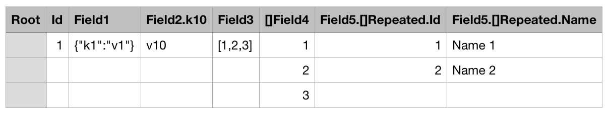
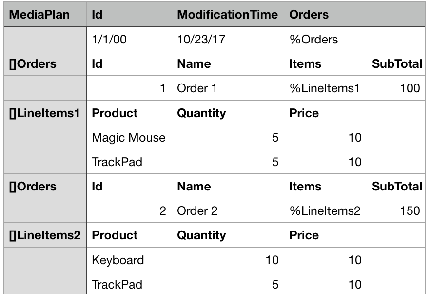
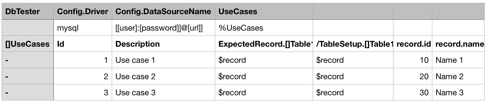
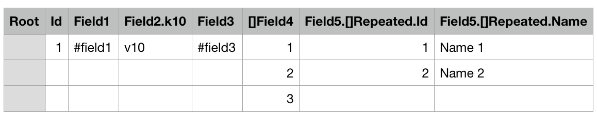
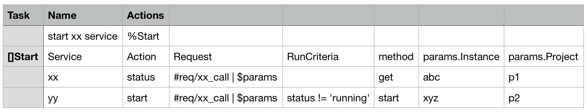
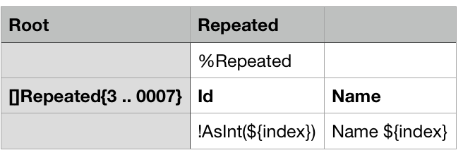
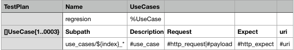

#Endly Introduction Workshop


## Prerequisites

1. [Download](https://github.com/viant/neatly/releases) neatly app

```text
tar xvzf neatly*.tar.gz
cp neatly /usr/local/bin
```

## What is neatly

Neatly is tabular  based document format for representing complex and large object structure.
Neatly comes with converter written in go LANG producing JSON, YAML or actual domain model object tree from neatly document


```text
 $ neatly -h
Usage of neatly:
  -f string
    	<output format> json or yaml (default "json")
  -i string
    	<neatly document path> 
  -v	neatly version
  -f string
    	<output format> json or yaml (default "json")
  -i string
    	<neatly document path> 
  -v	neatly version

```

## Motivation 

1. Format addressing json, yaml, xml maintaining complexity in representing large objects
2. Power of UI/datastore without it
3. Simple, readable and intuitive
4. Able to manage and organize hundred thousand+ objects
5. Cohesive
6. Extendable
7. Reusable


## Object tag


[Object-Tag](object-tag.csv) document.


```text
neatly -i object-tag
neatly -i object-tag -f yaml
```

The first column in a row represents an **object tag**, followed by columns defining the object fields. 
Next row/s would define object   tag values, in this case, the first column would be left empty.
If values are enclosed with { }, or [ ], they will be converted into an object or slice respectively.
In order to escape  {} or [] use {{ }} or [[ ]] respectively.

Field expression defines path to an object or array element value. The later would use [] as part of its expression.

The first object tag defined **root tag** and **root object**.


## Object tree  

[Object-Tree](object-tree.csv) document.


```text
neatly -i object-tree
neatly -i object-tree -f yaml
```

Neatly document can define one or more object tags, in order to linked then you can use forward reference '%'
If object tag contains [], the values would be elements of an array/slice.

## Root object  

[Root-Object](root-object.csv) document.



```text
neatly -i root-object
neatly -i root-object -f yaml
```

* root object reference start with '/' in field expression, it means filed values are being defined in the root object,
Root reference helps to manage data cohesion. 
* upper case starting field expression define an actual object
* lower case starting or ':' prefixed field expression define virtual object that can be use in data substitution ($ expression).


## External resources  

[External-Reference](object-tag2.csv) document.



In the latest version '@' is preferred over '#' to denote external resource.

```text
neatly -i object-tag2
neatly -i object-tag2 -f yaml
```

* external reference delegate portion of document to external files,
* json format or yaml format will be automatically converted into respective data structure. 
* file extension can be skipped for .json, .csv, .yaml, .txt


## Data substitution 

[Data-Substitution](data-substitution.csv)



```text
neatly -i data-substitution
neatly -i data-substitution -f yaml
```

Data substitution rules
    '$' path expression will be only substituted if can be evaluated with non empty value
    virtual object are place to context for current row only
    UDF wil be substituted only if it returns no error and in case it takes $ expression as parameter, expression path is present in context.
    Pipe expression can be used to provide additional substitution source. In this case if right side is an structure, any or all can be extracred with $ path expression.
    

Piping special variables:

    $args{index} - piping content stripped from first and last characters.
    $arg{index} - full piping content.

Where index corresponds to piping number starting with 0

## Tag range/interation

Tag Range expression **Tag{min..max}**, repeats all rows within the same TagId group  max - min times.

[TagRange](tag-range.csv)



```text
neatly -i tag-range
neatly -i tag-range -f yaml

```


Data substitution:

* $index / ${index} is a special/reserved keyword in this context it would expand to 01 in the firs iteration followed by 02, 03, 04 and 05. If there are more than one value row, all can be expanded to the same index value within the same iteration.
Note that number of digits in the upper bound range value creates a padding template. 1 .. 010 -> would '0' left pad an index to 3 digits 1 .. 00100 -> would '0' left pad an index to 5 digits.
* $tag expands to the current object tag.
* $tagId expands to current root object Name if specified, followed by object tag, object tag index, and subpath if specified.


UDF starts with ! followed by valid name of the register in the conext function.


## Tag range/iteration with subpath discovery

[Subpath](subpath.csv)


```text
neatly -i subpath
neatly -i subpath -f yaml
```


Subpath can use '*' as suffix to dynamically discover actual supath directory

Data substitution:

* $subPath expands to current subPath if specified for the tag
* $path expands to current path if sub path is specified for the tag


## External resource lookup

For any relative path lookup start with
1. Subpath directory if subpath specified
2. Neatly document path
3. Local/Remote repository is provided for neatly dao 


## User Defined Function


1.  AsMap
2.  AsInt
3.  AsFloat
4.  AsBool
5.  HasResource returns true if external resource exists
6.  Md5 generates md5 for provided parameter
7.  WorkingDirectory returns working directory joined with supplied sub path, '../' is supported.
8.  LoadNeatly loads neatly document as data structure.
9.  Length returns length of slice, map or string
10.  FormatTime, takes two arguments, date or now, followed by java style date format
11.  Zip, takes []byte or string to compress it.
12.  Unzip, takes []byte to uncompress it into []byte.
13.  UnzipText takes []byte to uncompress it into string.
14.  Markdown generate HTML for suppied markdown
15.  Cat returns content of supplied filename


*UDF registration*

In order to registry UDF you would have to extend current neatly functionality.

Here is a snipped that would show how to register UDF

```go


    import (
    		"github.com/viant/neatly"
        	"github.com/viant/toolbox/data"
        	"github.com/viant/toolbox/url"
    )


    var localAssetRepo, remoteAssetRepo string
	dao := neatly.NewDao(localAssetRepo, remoteAssetRepo, "yyyy-MM-dd h:mm:ss", nil)
	
	//user defined function
	var nilUdf = fun(source interface{}, state data.Map) (interface{}, error) {
		return nil, nil
	}
	
	var context = data.NewMap() //data is toolbox/data package
	//optionally register UDF
	context.Put("Nil", nilUdf)
    
	var targetObject = &MyStruct{} // or map[string]interface{}
	err := dao.Load(context, url.NewResource("mystruct.csv"), targetObject)
    if err != nil {
    	log.Fatal(err)
    }


```